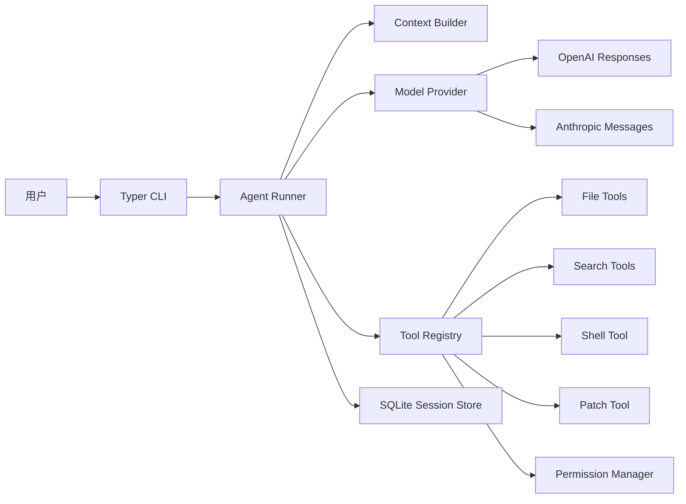

# YCZX Code 暑期开发路线

这份文档用于指导 `C:\Dev\yanchuaner\yczx_code` 的实际开发。目标是做出一个轻量级 Claude Code-like CLI Agent。

## 产品目标

最终用户可以在任意项目目录中运行：

```powershell
yczx ask "帮我阅读这个项目并生成 README"
yczx ask "分析这个报错并给出修复建议"
yczx ask "修改这个函数，让测试通过"
yczx chat
```

Agent 应该能够：

- 读取项目结构。
- 读取 `AGENTS.md`。
- 调用模型推理。
- 调用工具读文件、搜索文件、写文件、运行命令。
- 写文件和运行命令前请求确认。
- 展示 diff、日志和执行结果。
- 保存会话、工具调用、token 用量。

## 暑期不做

第一版不做：

- Web 后台。
- 校友白名单和订阅系统。
- 完整 GUI / `.exe`。
- 完整 MCP 客户端。
- 多 Agent 并行。
- 插件市场。
- API 中转、代充、转卖。

## 建议仓库结构

实际开发主仓库：`C:\Dev\yanchuaner\yczx_code`

```txt
yczx_code/
  README.md
  pyproject.toml
  uv.lock
  AGENTS.md
  src/
    yczx_code/
      __init__.py
      cli.py
      app.py
      config.py
      models/
        messages.py
        tools.py
        sessions.py
      providers/
        base.py
        openai_provider.py
        anthropic_provider.py
      agent/
        runner.py
        context.py
        prompts.py
        permissions.py
      tools/
        registry.py
        filesystem.py
        search.py
        shell.py
        patch.py
      storage/
        sqlite.py
        events.py
      ui/
        console.py
        diff.py
  tests/
    test_safe_path.py
    test_tool_registry.py
    test_context_builder.py
    test_permissions.py
  evals/
    cases/
      readme_generation.md
      error_analysis.md
      small_code_fix.md
  docs/
    architecture.md
    demo-script.md
    safety.md
```

第一版把所有代码放在当前仓库。`agent/`、`providers/`、`tools/` 先作为边界清晰的内部模块演进，等接口稳定并具备独立发布与维护价值后，再评估是否拆分。

## 架构图



## 核心模块

### 1. CLI

命令：

- `yczx ask <task>`：执行一次任务。
- `yczx chat`：进入交互会话。
- `yczx init`：生成 `AGENTS.md` 模板。
- `yczx config`：查看或修改配置。
- `yczx cost`：查看用量。
- `yczx history`：查看历史会话。

### 2. ModelProvider

统一模型接口：

```python
class ModelProvider:
    def stream(self, request: ModelRequest) -> Iterator[ModelEvent]:
        ...
```

第一版可以先只支持一个 Provider，但代码结构要允许后续添加 OpenAI、Anthropic、OpenAI-compatible endpoint。

### 3. Agent Runner

Agent Runner 负责完整循环：

```txt
构建上下文
-> 发送给模型
-> 接收文本或工具调用
-> 权限检查
-> 执行工具
-> 把工具结果反馈模型
-> 直到完成或达到步数上限
```

必须设置：

- 最大轮数
- 最大工具调用次数
- 最大上下文长度
- 超时
- 错误恢复

### 4. Tool Registry

工具接口：

```python
class Tool:
    name: str
    description: str
    input_model: type[BaseModel]

    def run(self, input: BaseModel, ctx: ToolContext) -> ToolResult:
        ...
```

第一版工具：

- `list_files`
- `read_file`
- `grep`
- `write_file`
- `apply_patch`
- `run_shell`

### 5. Permission Manager

权限模式：

- `read-only`：只允许读工具。
- `ask`：写文件和运行命令前确认。
- `auto`：低风险自动，高风险确认。

第一版默认 `ask`。

必须拦截：

- 写出项目根目录。
- 读取 `.env`、密钥文件、证书文件。
- 删除大量文件。
- 无限长命令。
- 无超时 shell。

### 6. Context Builder

默认收集：

- 用户任务。
- 当前工作目录。
- `AGENTS.md`。
- Git 分支和变更摘要。
- 文件树。
- 用户显式提到的文件。
- 最近会话摘要。

默认忽略：

- `.git`
- `node_modules`
- `.venv`
- `__pycache__`
- `dist`
- `build`
- 大文件
- 二进制文件

### 7. Session Store

使用 SQLite 保存：

- sessions
- messages
- tool_calls
- file_changes
- command_runs
- usage_records

这会让你的项目有“可观测性”，面试时很好讲。

## 8 周开发计划

### 第 0 周：项目初始化

任务：

- 在 `C:\Dev\yanchuaner\yczx_code` 初始化 uv 项目。
- 添加 Typer、Rich、Pydantic、pytest、Ruff。
- 创建基础目录。
- 实现 `yczx --help`。
- 添加 `README.md` 和 `AGENTS.md`。

验收：

```powershell
uv run yczx --help
uv run pytest
uv run ruff check .
```

### 第 1 周：CLI 骨架和本地工具

任务：

- 实现 `yczx init`。
- 实现 `yczx ask` 的空 runner。
- 实现 `list_files`、`read_file`。
- 实现路径安全检查。
- 用 Rich 输出文件树和 Markdown。

验收：

- `yczx init` 能生成 `AGENTS.md`。
- `yczx ask "列出项目文件"` 能在无模型情况下调用本地工具或 mock runner。
- 路径越界测试通过。

### 第 2 周：模型 Provider

任务：

- 实现 `ModelProvider` 抽象。
- 接入 OpenAI 或 Anthropic 二选一。
- 支持 streaming。
- 支持 usage 记录。
- 支持超时和错误提示。

验收：

- `yczx ask "解释这个项目"` 能调用真实模型。
- 流式输出正常。
- API Key 来自环境变量或本地配置，不进 Git。

### 第 3 周：Tool Calling 循环

任务：

- 定义 tool schema。
- 实现 `ToolRegistry`。
- 把 `list_files`、`read_file`、`grep` 暴露给模型。
- 实现模型请求工具、应用执行工具、结果返回模型的循环。

验收：

- Agent 面对“读 README 总结项目”会调用 `read_file`。
- Agent 面对“搜索 TODO”会调用 `grep`。
- 工具调用日志可见。

### 第 4 周：上下文工程

任务：

- 实现 `ContextBuilder`。
- 读取 `AGENTS.md`。
- 加入目录树、Git 状态、用户点名文件。
- 增加文件大小限制和 ignore 规则。
- 实现简单上下文摘要。

验收：

- Agent 能基于真实项目结构回答。
- 大文件不会塞进 prompt。
- `.env` 不会被读取。

### 第 5 周：写文件和 Diff

任务：

- 实现 `write_file`。
- 实现 `apply_patch` 或最小 diff 应用。
- 写文件前展示 diff。
- 用户确认后才写入。
- 保存 `file_changes`。

验收：

- Agent 能生成 README 并在确认后写入。
- 拒绝确认时没有文件变化。
- diff 展示清晰。

### 第 6 周：Shell 与测试闭环

任务：

- 实现 `run_shell`。
- 命令执行前确认。
- 限制 cwd、超时、输出长度。
- 支持运行 `pytest`。
- Agent 能根据测试失败继续修复。

验收：

- 在一个小示例项目中，Agent 能修复一个测试失败。
- 危险命令被拦截。
- stdout / stderr 被保存。

### 第 7 周：会话、成本和 Eval

任务：

- 实现 SQLite 存储。
- 保存 session、message、tool_call、usage。
- 实现 `yczx history` 和 `yczx cost`。
- 编写 eval cases。
- 增加 mock provider 测试。

验收：

- 能查看历史会话。
- 能查看 token 用量和成本估算。
- 5 个 eval case 至少稳定通过 4 个。

### 第 8 周：打磨与展示

任务：

- 完善 README。
- 完成架构图和 Demo 脚本。
- 录制演示。
- 写技术复盘。
- 整理后续计划：TUI、MCP、多模型、GUI。

验收：

- 一个新成员能按 README 启动项目。
- Demo 能完整展示：
  - 读取项目
  - 调用工具
  - 写文件前确认
  - 修改文件
  - 运行测试
  - 查看日志和成本

## 演示脚本

最小演示流程：

```powershell
cd C:\Dev\some-small-project
yczx init
yczx ask "阅读这个项目，生成一份 README 草稿"
yczx ask "把 README 写入文件，写入前展示 diff"
yczx ask "运行测试，如果失败请分析原因"
yczx history
yczx cost
```

## 质量门槛

每个阶段合并前至少满足：

- `uv run ruff format .`
- `uv run ruff check .`
- `uv run pytest`
- 手动跑一次核心 CLI 命令

## 安全规则

默认安全策略：

- 不读取 `.env`。
- 不打印完整 API Key。
- 不执行删除、格式化、关机、网络破坏类命令。
- 不写出工作目录。
- 所有写文件和 shell 命令默认需要确认。
- shell 必须有超时。
- shell 输出必须截断。
- 所有工具调用必须记录。

## 后续路线

第一阶段完成后，再进入：

1. Agent Core 模块化：稳定 providers、tools、runner、permissions 的内部接口，再评估是否需要独立发布。
2. Textual TUI：做更像 Codex GUI 的终端界面。
3. MCP：接入外部工具和插件。
4. 多模型协作：主模型、快模型、压缩模型、评审模型。
5. 桌面端：先在当前仓库内开发 GUI 或 `.exe` 包装，成熟后再评估拆分。
